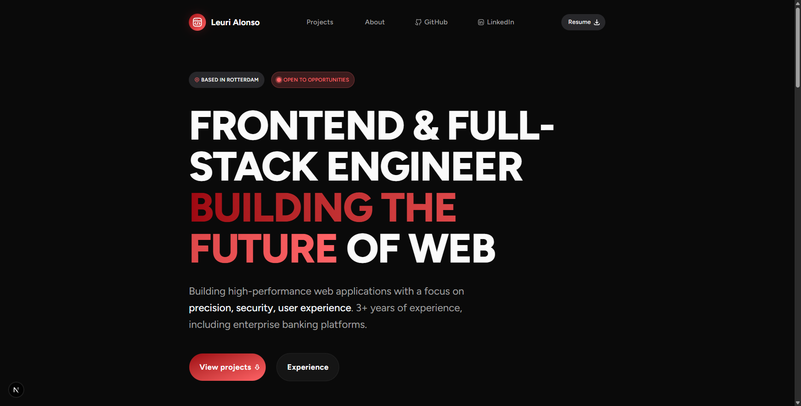

# Leuri Alonso — Software Engineer Portfolio

Personal portfolio showcasing my work as a **Frontend / Full-Stack Software Engineer**, including selected projects, technical skills and development practices.

The goal of this project is to demonstrate modern frontend development using a **production-ready stack** and professional tooling.

You can view the deployed portfolio here:  
[leurialonso.dev](https://leurialonso.dev)

---

## Preview

---

## Tech Stack

### Frontend

- Next.js
- TypeScript
- Tailwind CSS

### Tooling

- pnpm
- ESLint
- Prettier
- Husky (Git hooks)

---

## Features

- Modern responsive UI
- Optimized performance using Next.js
- Clean and maintainable component architecture
- Automated code quality checks
- Production-ready development workflow

---

## Code Quality

This project includes several tools to ensure consistent and maintainable code.

### ESLint

Static code analysis for detecting potential issues and enforcing best practices.

### Prettier

Automatic code formatting to maintain a consistent code style across the project.

### Husky

Git hooks used to automatically run checks before commits and pushes.

Examples of automated checks include:

- linting
- formatting
- type checking
- build verification

---

## Git Workflow

This repository follows a **Git Flow–inspired workflow**.

**main** → production-ready code  
**develop** → integration branch  
**feature/\*** → feature development  
**bugfix/\*** → bug fixes

Pull requests are used to integrate new features into the **develop** branch.

---

## Author

**Leuri Alonso Saturria**

Frontend / Full-Stack Software Engineer  
Based in Rotterdam 🇳🇱

GitHub  
https://github.com/leuri17

LinkedIn  
https://linkedin.com/in/leuri17
